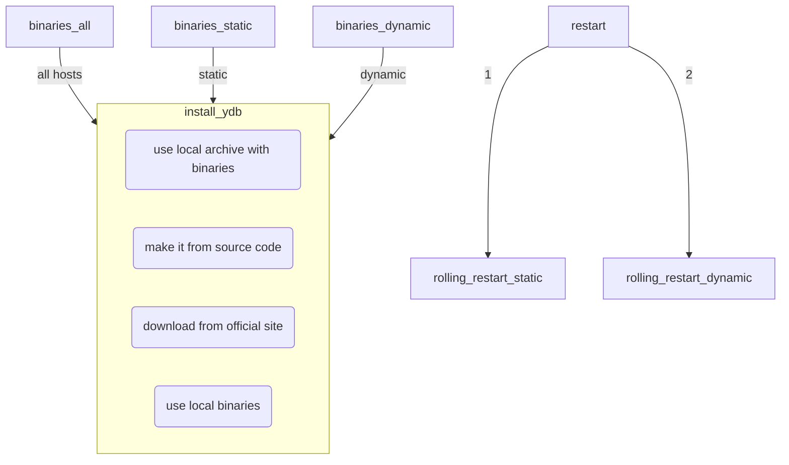
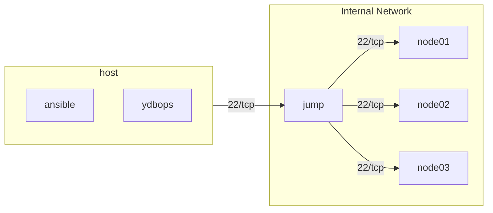

# Deploying YDB cluster with Ansible

Ansible playbooks supporting the deployment of [YDB](https://ydb.tech) clusters into VM or baremetal servers.

Currently, the playbooks support the following scenarios:

* the initial deployment of YDB static (storage) nodes;
* YDB database creation;
* the initial deployment of YDB dynamic (database) nodes;
* adding extra YDB dynamic nodes to the YDB cluster;
* updating cluster configuration file and TLS certificates, with automatic rolling restart.

The following scenarios are yet to be implemented (TODO):

* configuring extra storage devices within the existing YDB static nodes;
* adding extra YDB static nodes to the existing cluster;
* removing YDB dynamic nodes from the existing cluster.

Current limitations:

* supported python interpreter version on managed should must be >= 3.7
* configuration file customization depends on the support of automatic actor system threads management, which requires YDB version 23.1.26.hotfix1 or later;
* the cluster configuration file has to be manually created;
* there are no examples for configuring the storage nodes with different disk layouts (it seems to be doable by defining different `ydb_disks` values for different host groups).

## Ansible Collection - ydb_platform.ydb

Documentation for the collection.

### Playbook configuration settings

Default configuration settings are defined in the `group_vars/all` file as a set of Ansible variables. An example file is provided. Different playbook executions may require different variable values, which can be accomplished by specifying extra JSON-format files and passing those files [in the command line](https://docs.ansible.com/ansible/latest/playbook_guide/playbooks_variables.html#vars-from-a-json-or-yaml-file).

The meaning and format of the variables used are specified in the table below.

| Variable | Meaning |
| --------- | ------- |
| `ydb_libidn_archive` | Enable the installation of custom-built libidn for RHEL, AlmaLinux or Rocky Linux. |
| `ydb_libidn_archive_unpack_options` | Extra flags to be passed to `tar` for unpacking custom-built libidn package. Default value: `['--strip-component=1']` |
| `ydb_archive` |  YDB server binary package in .tar.gz format |
| `ydb_archive_unpack_options` | Extra flags to be passed to `tar` for unpacking the YDB server binaries. Default value: `['--strip-component=1']` |
| `ydb_config` | The name of the cluster configuration file within the `files` subdirectory (**without** the `actor_system_config` snippet!) |
| `ydb_tls_dir` | Path to the local directory with the TLS certificates and keys, as generated by the [sample script](https://github.com/ydb-platform/ydb/tree/main/ydb/deploy/tls_cert_gen), or following the filename convention used by the sample script |
| `ydb_domain` | The name of the root domain hosting the databases, value `Root` is used in the YDB documentation |
| `ydb_disks` | Disk layout of storage nodes, defined as `ydbd_static` in the hosts file. Defined as list of structures having the following fields:<br/> `name` - physical device name (like `/dev/sdb` or `/dev/vdb`);<br/> `label` - the desired YDB data partition label, as used in the cluster configuration file (like `ydb_disk_1`) |
| `ydb_dynnodes` | Set of dynamic nodes to be ran on each host listed as `ydbd_dynamic` in the hosts file. Defined as list of structures having the following fields:<br/> `dbname` - name of the YDB database handled by the corresponding dynamic node;<br/> `instance` - dynamic node service instance name, allowing to distinguish between multiple dynamic nodes for the same database running in the same host;<br/> `offset` - integer number `0-N`, used as the offset for the standard network port numbers (`0` means using the standard ports). |
| `ydb_brokers` | List of host names running the YDB static nodes, exactly 3 (three) host names must be specified |
| `ydb_cores_static` | Number of cores to be used by thread pools of the static nodes |
| `ydb_cores_dynamic` | Number of cores to be used by thread pools of the dynamic nodes |
| `ydb_dbname` | Database name, for database creation, dynamic nodes deployment and dynamic nodes rolling restart |
| `ydb_pool_kind` | YDB default storage pool kind, as specified in the static nodes configuration file in the `storage_pool_types.kind` field |
| `ydb_database_groups` | Initial number of storage groups in the newly created database |
| `ydb_dynnode_restart_sleep_seconds` | Number of seconds to sleep after startup of each dynamic node during the rolling restart. |

### Installing the YDB cluster using Ansible

Overall installation is performed according to the [official instruction](https://ydb.tech/en/docs/deploy/manual/deploy-ydb-on-premises), with several steps automated with Ansible. The steps below are adopted for the Ansible-based process:

1. [Review the system requirements](https://ydb.tech/en/docs/deploy/manual/deploy-ydb-on-premises#requirements), and prepare the YDB hosts. Ensure that SSH access and sudo-based root privileges are available.
1. [Prepare the TLS certificates](https://ydb.tech/en/docs/deploy/manual/deploy-ydb-on-premises#tls-certificates), the provided [sample script](https://github.com/ydb-platform/ydb/tree/main/ydb/deploy/tls_cert_gen) may be used for automation of this step.
1. Download the [YDB server distribution](https://ydb.tech/en/docs/downloads/#ydb-server). It is better to use the latest binary version available.
1. Ensure that you have Python 3.8 or later installed on all hosts of the cluster.
1. Configure the passwordless SSH access to all hosts of the cluster.
1. Configure the [priviledge escalation](https://docs.ansible.com/ansible/latest/playbook_guide/playbooks_privilege_escalation.html) on all hosts of the cluster, such as passwordless sudo for the user account with the SSH access.
1. Install `ansible-core` version 2.11-2.15. Ansible 2.10 or older is not supported.
1. Install the required YDB Ansible collections from Github:

    ```bash
    ansible-galaxy collection install git+https://github.com/ydb-platform/ydb-ansible.git
    ```

    Alternatively, download the current releases of Ansible collections for [YDB](https://github.com/ydb-platform/ydb-ansible/releases), [community.general](https://github.com/ansible-collections/community.general/releases) and [Prometheus](https://github.com/prometheus-community/ansible/releases), and install the collections from the archives:

    ```bash
    ansible-galaxy collection install community.general-X.Y.Z.tar.gz
    ansible-galaxy collection install prometheus-prometheus-X.Y.Z.tar.gz
    ansible-galaxy collection install ydb-ansible-X.Y.tar.gz
    ```

1. In the new subdirectory, create the `ansible.cfg` file using the [provided example](https://github.com/ydb-platform/ydb-ansible-examples/blob/main/3-nodes-mirror-3-dc/ansible.cfg).
1. Create the `files` and `files/certs` directories, and put the TLS keys and certificates there. If the certificates were generated using the provided helper script, the `CA/certs/YYYY-MM-DD_hh-mm-ss` subdirectory should typically be copied as `files/certs`.
1. Create the `inventory/50-inventory.yaml`, `inventory/99-inventory-vault.yaml` files. These files contain the host list, installation configuration and secrets to be used. The example files are provided: [inventory.yaml](https://github.com/ydb-platform/ydb-ansible-examples/blob/main/3-nodes-mirror-3-dc/inventory/50-inventory.yaml), [inventory-vault.yaml](https://github.com/ydb-platform/ydb-ansible-examples/blob/main/3-nodes-mirror-3-dc/inventory/99-inventory-vault.yaml).
1. Create the [Ansible Vault](https://docs.ansible.com/ansible/latest/vault_guide/vault_managing_passwords.html) password file as `ansible_vault_password_file`, with the password to protect the sensible secrets.
1. Encrypt `inventory/99-inventory-vault.yaml` with `ansible-vault encrypt inventory/99-inventory-vault.yaml` command. To edit this file use command `ansible-vault edit inventory/99-inventory-vault.yaml`.
1. Prepare the cluster configuration file [according to the instructions in the documentation](https://ydb.tech/en/docs/deploy/manual/deploy-ydb-on-premises#config), and save as `files/config.yaml`. Omit the `actor_system_config` section - it will be added automatically.
1. Create the setup playbook based on the [provided example](examples/common/setup_playbook.yaml). Customize the required actions as needed.
1. Deploy the YDB cluster by running the playbook with the following command:

    ```bash
    ansible-playbook ydb_platform.ydb.initial_setup
    ```

### Updating the cluster configuration files

To update the YDB cluster configuration files (`ydbd-config.yaml`, TLS certificates and keys) using the Ansible playbook, the following actions are necessary:

1. Ensure that the `hosts` file contains the current list of YDB cluster nodes, both static and dynamic.
1. Ensure that the configuration variable `ydbd_config` in the `group_vars/all` file points to the desired YDB server configuration file.
1. Ensure that the configuration variable `ydbd_tls_dir` points to the directory containing the desired TLS key and certificate files for all the nodes within the YDB cluster.
1. Apply the updated configuration to the cluster by running the `run-update-config.sh` script. Ensure that the playbook has been completed successfully, and diagnose and fix execution errors if they happen.

Notes:

1. Please take into account that rolling restart is performed node by node, and for a large cluster the process may consume a significant amount of time.
1. For Certificate Authority (CA) certificate rotation, at least two separate configuration updates are needed:
    * first to deploy the ca.crt file, containing both new and old CA certificates;
    * second to deploy the fresh server keys and certificates signed by the new CA certificate.

### What is actually done by the playbooks?

#### Actions executed for installing YDB nodes

1. libaio or libaio1 is installed, depending on the operating system
1. chrony is installed and enabled to ensure time synchronization
1. jq is installed to support some scripting logic used in the playbooks
1. YDB user group and user is created
1. YDB installation directory is created
1. YDB server software binary package is unpacked into the YDB installation directory
1. YDB client package automatic update checks are disabled for the YDB user, to avoid extra messages from client commands.
1. YDB TLS certificates and keys are copied to each server
1. YDB cluster configuration file is copied to each server
1. [Transparent huge pages](https://www.kernel.org/doc/html/latest/admin-guide/mm/transhuge.html) (THP) are enabled on each server, which is implemented by the creation, activation and start of the corresponding systemd service.

#### Actions executed for the initial deployment of YDB storage cluster

1. Installation actions are executed.
1. For each disk configured, it is checked for the existing YDB data. If none found, disk is completely re-partitioned, and obliterated. For the existing YDB data, no changes are made.
   > WARNING: the safety checks do not work for YDB disks using non-default encryption keys. DATA LOSS IS POSSIBLE if the encryption is actually used. Probably an enhancement is needed to support the encryption key to be specified in the deployment option.
1. `ydbd-storage.service` is created and configured as the systemd service.
1. `ydbd-storage.service` is started, and the playbook waits for static nodes to come up.
1. YDB blobstorage configuration is applied with the `ydbd admin blobstorage init` command.
1. The playbook waits for the completion of YDB storage initialization.
1. The initial password for the `root` user is configured according to contents of the `files/secret` file.

#### Actions executed for YDB dynamic nodes deployment

1. Installation actions are executed.
1. For each database configured, the list of YDB dynnode systemd services are created and configured.
1. YDB dynnode services are started.

#### Actions executed for the configuration update

1. YDB TLS certificates and keys are copied to each server.
1. YDB cluster configuration file is copied to each server.
1. Rolling restart is performed for YDB storage nodes, node by node, checking for the YDB storage cluster to become healthy after the restart of each node.
1. Rolling restart is performed for YDB database nodes, server by server, restarting all nodes sitting in the single server at a time, and waiting for the specified number of seconds after each server's nodes restart.

## List of playbooks
- ydb_platform.ydb.initial_setup - Install cluster from scratch
- ydb_platform.ydb.binaries_all - Install YDB binaries to all nodes
- ydb_platform.ydb.binaries_static - Install YDB binaries to all static/storage nodes
- ydb_platform.ydb.binaries_dynamic - Install YDB binaries to all dynamic nodes
- ydb_platform.ydb.restart - Restart static (weak mode) and after that dynamic nodes
- ydb_platform.ydb.rolling_restart_static - Restart static nodes in weak mode
- ydb_platform.ydb.rolling_restart_dynamic - Restart dynamic nodes



## Supported operation system

- ydb_platform.ydb.initial_setup - Install cluster
    - Ubuntu 22.04, 24.04
    - Debian 11.11, 12.7
    - AstraLinux 1.7
    - AlmaLinux 8,9
    - RedHat 9
    - RedOS 7

# Install in isolated mode
Isolated mode - situation when hosts are isolated from Internet (intranet, secure environment). There two possible way to install:
1. Use bastion / jump host
2. Use internal preconfigured host

## Install with bastion
The procedure of install is just the same like common install. But there're some limitations and recomendations.

- Required settings in inventory (50-inventory.yaml)
```
    ansible_user: bastion_username
    ansible_ssh_common_args: "-o StrictHostKeyChecking=no -o User=node_username -A -J bastion_username@{{ lookup('env','JUMP_IP') }}"
    # This key must work with all nodes (bastion and YDB hosts)
    # Or you must specify for hosts specific private key in ansible_ssh_common_args
    ansible_ssh_private_key_file: "~/.ssh/id_rsa"
```
- YDB Dstool must be installed from binary (50-inventory.yaml)
```
    ydb_dstool_binary: "{{ ansible_config_file | dirname }}/files/ydb-dstool"
```



WARNING: Cluster restart doesn't work with bastion without direct access to FQDN nodes via 2135/tcp.

## Install with preconfigured host
1) Prepare binaries:
    - create docker image for Ansible by using Dockerfile (Internet connection is required, for example: `docker build . -t ydb-ansible`) and save it as a binary file (`docker save ydb-ansible -o ydb-ansible.image`)
    - download YDB archive or build binaries from sources
    - download YDB Dstool (or create it from sources)
    - download YDBOps (https://github.com/ydb-platform/ydbops/releases)
1) Prepare host for ansible:
    - install Docker (For example, apt install docker.io)
    - install YDB docker image (`docker load -i ydb-ansible.image`)
    - upload binary files (ydb, ydb-dstool, ydbd, ydbops)
1) Prepare ansible configuration as it is described above (TLS certificates, config, inventory). Required settings in inventory (50-inventory.yaml)
```
        ydb_tls_dir: "{{ ansible_config_file | dirname }}/TLS/CA/certs/2024-11-21_09-07-03"
        ydbd_binary: "{{ ansible_config_file | dirname }}/files/ydbd"
        ydb_cli_binary: "{{ ansible_config_file | dirname }}/files/ydb"
        ydb_version: "24.4.1"
        ydbops_binary: "{{ ansible_config_file | dirname }}/files/ydbops"
        ydb_dstool_binary: "{{ ansible_config_file | dirname }}/files/ydb-dstool"
```

HINT: All files paths must be in ansible folder. This folder will be mounted as `/ansible` in docker container.

4) Execute playbook from the ansible folder with configured files:
```
sudo docker run -it --rm \
	-v $(pwd):/ansible \
	-v /home/ansible/.ssh:/root/.ssh \
	ydb-ansible ansible-playbook ydb_platform.ydb.initial_setup
```

### Control hosts by ansilbe via console
```
sudo docker run -it --rm \
        -v $(pwd):/ansible \
        -v /home/ansible/.ssh:/root/.ssh \
        ydb-ansible ansible-console ydb
```

### Use different ansible collection
You can download another version of YDB Ansible collection or get official archive and change it in your own way.

```
git clone https://github.com/ydb-platform/ydb-ansible /home/ansible/ydb-ansible
cd /home/ansible/ydb-ansible
git checkout SOMEBRANCH
```

```
sudo docker run -it --rm \
        -v $(pwd):/ansible \
        -v /home/ansible/.ssh:/root/.ssh \
        -v /home/ansible/ydb-ansible:/root/.ansible/collections/ansible_collections/ydb_platform/ydb \
        ydb-ansible ansible-console ydb
```
# Dynamic config

Dynamic config (https://ydb.tech/docs/en/maintenance/manual/dynamic-config) allows to configure dynamic nodes without local configs.

To use dynamic configs you will have to turn off `ydb_enforce_user_token_requirement` and set `ydb_use_dynamic_config` in `true`.

You can define your own dynamic config. In this case you can take `roles/ydb_static/templates/ydb-din-config.yaml.j2` as an example and make appropriate changes.

```YAML
        ydb_enforce_user_token_requirement: false

        # ydb_use_dynamic_config - define how to configure dynamic nodes - static or dynamic configs
        # Default value: false
        ydb_use_dynamic_config: true

        # ydb_dynamic_config - path to a custom dynamic config file
        # Default value: ansible/roles/ydb_static/templates/ydb-din-config.yaml.j2
        # ydb_dynamic_config: 
```